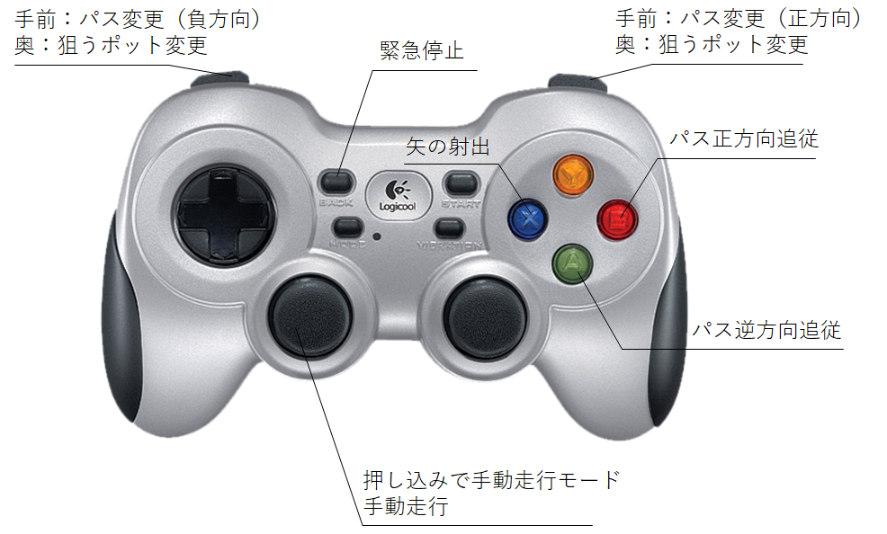

[](https://app.travis-ci.com/KeioRoboticsAssociation/nhk2021_ilias) [](https://www.gnu.org/licenses/gpl-3.0) [](https://keiorogiken.wordpress.com/)

# nhk2021_ilias

**NHK Robocon 2021** project  team "**ilias**" (KeioRoboticsAssociation:robot:)


## Install

Clone this repository and just run `install.sh`

```shell
cd ~/catkin_ws/src
git clone https://github.com/KeioRoboticsAssociation/nhk2021_ilias.git
cd nhk2021_ilias
source install.sh
```

[Here](https://github.com/KeioRoboticsAssociation/nhk2021_ilias/blob/main/Dependencies.md) is a detail description about installing and dependencies of this repository.


## 各パッケージについて
- [arrow_table_commander](https://github.com/KeioRoboticsAssociation/nhk2021_ilias/blob/main/arrow_table_commander/README.md)

  射出台の回転テーブル角決定を担当するパッケージ

- [bezier_path_planning_pursuit](https://github.com/KeioRoboticsAssociation/nhk2021_ilias/blob/main/bezier_path_planning_pursuit/README.md)

  経路計画、追従を担当するパッケージ

- [joy_commander](https://github.com/KeioRoboticsAssociation/nhk2021_ilias/blob/main/joy_commander/README.md)

  Joyコンで速度指令値を送れるパッケージ

- [nhk2021_launcher](https://github.com/KeioRoboticsAssociation/nhk2021_ilias/blob/main/nhk2021_launcher/README.md)

  ロボットを起動するlaunchファイルが入っているパッケージ

- [nhk2021_simulator](https://github.com/KeioRoboticsAssociation/nhk2021_ilias/blob/main/nhk2021_simulator/README.md)

  Gazeboによるシミュレーターを構築するためのファイルが入っているパッケージ

- [nhk2021_webgui](https://github.com/KeioRoboticsAssociation/nhk2021_ilias/blob/main/nhk2021_webgui/README.md)

  WebGUIを起動するためのファイルが入っているパッケージ

- [pot_position_estimator](https://github.com/KeioRoboticsAssociation/nhk2021_ilias/blob/main/pot_position_estimator/README.md)

  RGBDカメラ (Realsense D455) を用いてポットの位置を推定するパッケージ


## シミュレーターの簡単な遊び方

1. フィールドとロボットモデルのリスポーン

- TRの場合

  ```
  roslaunch nhk2021_simulator swerve_simulation_TR.launch
  ```

- DRの場合

  ```
  roslaunch nhk2021_simulator swerve_simulation_DR.launch
  ```

2. コントローラーの起動

- TR

  ```shell
  roslaunch nhk2021_launcher control_TR.launch
  ```

- DR

  ```shell
  roslaunch nhk2021_launcher control_DR.launch
  ```

  キーコンフィグ

  

  
3. WebGUIのリンクは[こちら](http://localhost:8085/nhk2021_webgui/WebGUI.html)


## Lisence

The applications are licensed under GPLv3 license.
